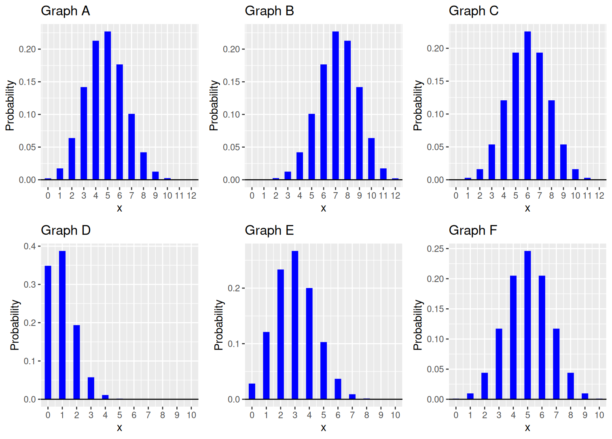

```{css, echo = F}
.soln {
background-color: #E6E6FA;
}
```

```{r setup, include=FALSE}
knitr::opts_chunk$set(echo = TRUE, message = FALSE,
                      warning = FALSE, error = TRUE,
                      fig.height = 3)
library(tidyverse)
```

```{r, echo=F}
old <- theme_get()

theme_set(theme(panel.background = element_rect(fill = "#ededfb")))
```

# Preliminaries

- This file should be in `STAT240/homework/hw06` on your local computer.

# Problem 1

For each of the following descriptions, say whether the random variable is reasonably approximated by a binomial random variable or not, and explain your answer. If the variable is binomial, identify $n$ the number of trials and $p$ the probability of success.  If it is not binomial, identify which of the "BINS" assumptions is violated.

(a) A fair die is rolled until a 1 appears, and $X$ denotes the number of rolls.

<span style="color:#5858d0"> Not binomial, since there is not a fixed number of trials. </span>

(b) Twenty of the different Badger basketball players each attempt 1 free throw and $X$ is the total number of successful attempts.

<span style="color:#5858d0"> Not binomial, since the probability of success isn't the same between players. </span>

(c) A die is rolled 50 times. Let $X$ be the face that lands up most often.

<span style="color:#5858d0"> Not binomial, since the outcome is not a number of pre-defined successes. </span>

(d) In a bag of 10 batteries, I know 2 are old. Let $X$ be the number of old batteries I choose when taking a sample of 4 to put into my calculator.

<span style="color:#5858d0"> Not binomial. A large sample size (4) relative to population size (10) means sampling without replacement will affect the additional draws, so the trials are not independent. </span>

(e) It is reported that 20% of Madison homeowners have installed a home security system. Let $X$ be the number of homes without home security systems installed in a random sample of 100 houses in the Madison city limits.

<span style="color:#5858d0"> Binomial! 100 fixed trials, S = no home security installed, $p = 0.80$, $1-p = 0.20$, n = 100.  The number of homes is so large, we can assume independence between homes in a random sample of just 100. </span>


# Problem 2

(a) Create a data frame with the following columns.
Each row corresponds to a single $\text{Binom}(n, p)$ distribution. The first two columns are the parameters of the distribution.

- `n`, which is always equal to 100
- `p`, which ranges from 0 to 1 by 0.01 $(0, 0.01, 0.02, \ldots , 0.99, 1)$
- `mu`, the mean
- `sigma`, the standard deviation
- `q90`, the 0.9 quantile (or 90th percentile)

```{r, class.source="soln", class.output="soln"}
binoms <-  tibble(
  n = 100,
  p = seq(0, 1, 0.01),
  mu = n*p,
  sigma = sqrt(n*p*(1-p)),
  q90 = qbinom(0.9, n, p))
```

(b) Create line plots of the following:
- $\sigma$ versus $p$
- 90th percentile versus $p$


```{r, class.source="soln", class.output="soln"}
ggplot(binoms, aes(x = p, y = sigma)) +
  geom_line() +
  xlab("p") +
  ylab("sigma") +
  ggtitle("Binomial Standard Deviation versus p)")
```

```{r, class.source="soln", class.output="soln"}
ggplot(binoms, aes(x = p, y = q90)) +
  geom_line() +
  xlab("p") +
  ylab("0.90 Quantile") +
  ggtitle("Binomial Quantile versus p")
```

(c) How does the standard deviation change with $p$?

<span style="color:#5858d0"> The standard deviation is largest when $p = 0.5$.  It gets smaller as $p$ gets closer to 0 and closer to 1. </span>

(d) Comment on the relationship between the 90th percentile and $p$.

<span style="color:#5858d0"> As $p$ increases, the 90th percentile q90 does as well.  However, this is a jagged and not smooth line, since the binomial is discrete, so there are "jumps" between different integers. </span>


# Problem 3

The random variable $X$ has the $\text{Binom}(100, 0.2)$ distribution.

(a) Find an integer $a$ so that $P(X \le a) \ge 0.5$. (There are many choices for $a$).  Show the value of $P(X \le a)$ with `pbinom()`.

<span style="color:#5858d0"> For $P(X \le a)$ to be at least 0.5,  most of the probability of $X$ must be at or below $a$.  One choice is $a = 30$, since $P(X \le 30) = 0.994$. </span>

```{r, class.source="soln", class.output="soln"}
pbinom(30, 100, 0.2)
```

(b) Find an integer $b$ so that $P(X \ge b) \ge 0.5$. (There are many choices for $b$). Show the value of $P(X \ge b)$ with `pbinom()`. 

<span style="color:#5858d0"> For $P(X \ge b)$ to be at least 0.5,  most of the probability of $X$ must be at or above $b$.  One choice is $b = 15$, since $P(X \ge 15) = 0.92$. </span>

```{r, class.source="soln", class.output="soln"}
1 - pbinom(14, 100, 0.2)
```

  
(c) Find an integer $c$ so that $P(X \le c) \ge 0.5$ *and* $P(X \ge c) \ge 0.5$. Show the values of $c$, $P(X \le c)$, and $P(X \ge c)$.

<span style="color:#5858d0"> For $P(X \le c)$ and $P(X \ge c)$ to both be at least 0.5, $c$ must be a number close to the center of the probability.  So, we'll start by finding the 50th percentile of $X$ with `qbinom()`. </span>

```{r, class.source="soln", class.output="soln"}
qbinom(0.5, 100, 0.2)
```

<span style="color:#5858d0"> So $P(X \le 20)$ is at least 0.5.  Using `pbinom()`, we can verify that $P(X \le 20)$ and $P(X \ge 20)$ are both more than 0.5. </span>

```{r, class.source="soln", class.output="soln"}
# P(X <= 20)
pbinom(20, 100, 0.2)

# P(X >= 20)
1 - pbinom(19, 100, 0.2)
```


# Problem 4

A student decided to guess randomly on their True/False quiz.  The number of questions they answer correctly is $\text{Binom}(10, 0.5)$.  Write code with `dbinom`, `pbinom`, or `qbinom` to calculate each value or probability.

- "I know I must have gotten at least one question right!"

```{r, class.source="soln", class.output="soln"}
# Probability of at least one correct answer
1 - dbinom(0, 10, 0.5)
# or 
pbinom(0, 10, 0.5, lower.tail = F)
```

- "I probably got 3 - 5 of the questions right."

```{r, class.source="soln", class.output="soln"}
# Probability of 3 - 5 (inclusive) correct answers
pbinom(5, 10, 0.5) - pbinom(2, 10, 0.5)
```

- "I feel lucky.  The answers I picked are better than 90% of my other attempts!"

```{r, class.source="soln", class.output="soln"}
# 90th percentile
qbinom(0.9, 10, 0.5)
```

Explain why the 90th percentile is not 9. 

<span style="color:#5858d0"> The percentile is calculated based on the probabilities of the different values in the population, not the 90th percentile of the values themselves.  We can see that 7 is the smallest value of x such that $P(X \le x)$ is at least 0.9. </span>

```{r, class.source="soln", class.output="soln"}
pbinom(7, 10, 0.5)

pbinom(6, 10, 0.5)
```


# Problem 5

Match the four binomial distributions given below to the appropriate graph in `p5_choices.png`. Briefly justify your choices.

- Binom(12, 0.5)

<span style="color:#5858d0"> Graph C.  It must be one of the top 3 graphs, since the upper 3 have values from 0 to 12.  For the probability to be 0.5, the graph of the distribution would have to be symmetric. </span>

- Binom(12, 0.6)

<span style="color:#5858d0"> Graph B.  The probability is shifted slightly to the right of Graph C (e.g. 7 has more probability than 6) which reflects the fact that we have the same n but a larger p. </span>

- Binom(10, 0.1)

<span style="color:#5858d0"> Graph D.  It must be one of the lower 3 graphs, since they have values from 0 to 10.  Graph D has its probabilities very concentrated on the left side of the graph near 0 and 1. </span>

- Binom(10, 0.3)

<span style="color:#5858d0"> Graph E.  The probability is shifted to the right compared to Graph D, but it is still primarily on the left side of the graph.  It can't be Graph F because F is perfectly symmetric. </span>




# Problem 6

(a) Identify whether each of the statements below are *always true*, *sometimes true*, or *never true* for Binomial random variables.  Briefly explain your answers. You can optionally use R to help make your argument.

- The distribution has no limits and covers the entire number line.

<span style="color:#5858d0"> This is never true. A binomial random variable counts the number of successes in a fixed number of trials, so it has a limit in either direction. The minimum is 0 and the maximum is the number of trials $n$. </span>

- The 50th percentile is less than the 60th percentile.

<span style="color:#5858d0"> This is sometimes true.  Because of how discrete percentiles are calculated, the 50th and 60th percentiles can be the same if there are very few possible values. </span>

```{r, class.source="soln", class.output="soln"}
# 50th and 60th percentiles are different in this case
qbinom(c(0.5, 0.6), size = 50, prob = 0.4)

# 50th and 60th percentiles are the same in this case
qbinom(c(0.5, 0.6), size = 3, prob = 0.6)
```


- If $\mu$ is the mean of the distribution, then the probability distribution graphically reaches its maximum at $\mu$.

<span style="color:#5858d0"> This is sometimes true, in the case of a symmetric binomial random variable with an odd number of possible values.  But this is false for binomials with $p \neq 0.5$ or binomials where $\mu$ is not a possible value. </span>

- If $\mu$ is the mean of the distribution, then the probability of getting exactly $\mu$ on a random draw is non-zero.

<span style="color:#5858d0"> This is sometimes true, depending on whether $\mu$ is a possible value or not.  For some binomial variables, $\mu$ is a decimal, which is impossible to observe. </span>

```{r, class.source="soln", class.output="soln"}
# 4 is the mean of Binom(16, 0.25)
dbinom(4, 16, 0.25)

# 2.4 is the mean of Binom(6, 0.4)
dbinom(2.4, 6, 0.4)
```


(b) Repeat part (a), but assess the truth of each statement for Normal random variables.

- The distribution has no limits and covers the entire number line.

<span style="color:#5858d0"> This is always true.  The tails stretch all the way to negative and positive infinity, although they get very very close to 0 outside of the bell-curve shape. </span>

- The 50th percentile is less than the 60th percentile.

<span style="color:#5858d0"> This is always true, since Normal RVs are continuous.  The 50th and 60th percentiles make a "slice" of 10% of the area under the curve, so they must be different numbers. </span>

```{r, class.source="soln", class.output="soln"}
# 50th and 60th percentile of a standard normal
qnorm(c(0.5, 0.6))
```

- If $\mu$ is the mean of the distribution, then the probability distribution graphically reaches its maximum at $\mu$.

<span style="color:#5858d0"> This is always true for Normal RVs, since each one is a perfectly symmetric bell curve with its peak at $\mu$. </span>

- If $\mu$ is the mean of the distribution, then the probability of getting exactly $\mu$ on a random draw is non-zero.

<span style="color:#5858d0"> This is never true, since Normal RVs are continuous, and the probability of any individual point, $\mu$ or otherwise, is 0. </span>


# Problem 7

Use `pnorm` to find the following probabilities on X ~ N(0, 1).

(a) $P(X < -1)$

<span style="color:#5858d0"> To find the area below a value, use pnorm's default functionality. </span>

```{r, class.source="soln", class.output="soln"}
pnorm(-1)
```


(b) $P(X > 1)$

<span style="color:#5858d0"> To find an area above, use subtraction or set `lower.tail = F`. This is also the same as the probability in (a). </span>

```{r, class.source="soln", class.output="soln"}
1 - pnorm(1)
# or
pnorm(1, lower.tail = F)
```


(c) $P(0.5 < X < 2)$

<span style="color:#5858d0"> To find an area between two points, subtract two calls to pnorm. </span>

```{r, class.source="soln", class.output="soln"}
pnorm(2) - pnorm(0.5)
```


(d) $P(|X| > 0.75)$

<span style="color:#5858d0"> We can add two calls to pnorm or take advantage of the fact that the curve is symmetric around 0. </span>

```{r, class.source="soln", class.output="soln"}
pnorm(-0.75) + pnorm(0.75, lower.tail = F)
# or
2 * pnorm(-0.75)
```


# Problem 8

Let $X_1$ and $X_2$ be two draws from $X ~ N(10, 4)$. Order the five events below based on which events are least to most likely to occur.

- Event A: $X_1 > 15$
- Event B: $X_1 = 15$
- Event C: $X_1 < 15$
- Event D: $X_1 > 15$ AND $X_2 > 15$
- Event E: $X_1 > X_2$

<span style="color:#5858d0"> Since $X$ is continuous, event B is impossible, since we can't define probabilities at a specific point.  We can find the probabilities of events A and C using pnorm. </span>

```{r, class.source="soln", class.output="soln"}
# Event A
pnorm(15, 10, 4, lower.tail = F)

# Event C
pnorm(15, 10, 4)
```

<span style="color:#5858d0"> $P(A) = 0.106$ and $P(C) = 0.894$.  If event D happens, then that means we draw a value above 15 two times in a row, so $P(D) = 0.106 \cdot 0.106 = 0.011$.  Finally, $P(E)$ is 0.5 by symmetry.  We have B < D < A < E < C. </span>


